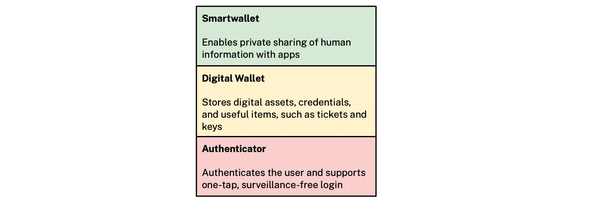

Inspired by the Linux Foundation’s [announcement](https://www.linuxfoundation.org/press/linux-foundation-announces-an-intent-to-form-the-openwallet-foundation) about the [OpenWallet Foundation](https://openwallet.foundation/), I drew a picture of how smartwallet relates to a digital wallet and an authenticator from a functionality perspective.

Starting at the bottom we have a simple an authenticator app (e.g. [Microsoft Authenticator](https://www.microsoft.com/en-us/security/mobile-authenticator-app)) that authenticates the individual. Next we have a digital wallet that adds the ability to import, store, and present credentials, digital assets and useful items such as tickets and keys to other apps. Finally, at the top we have a smartwallet that adds (i) privacy policy expression (e.g. [https://globalprivacycontrol.org](https://globalprivacycontrol.org/)) and (ii) bi-directional “private sharing” of data between the wallet and an app/site under a legal regime wherein the person remains in control of their data.

