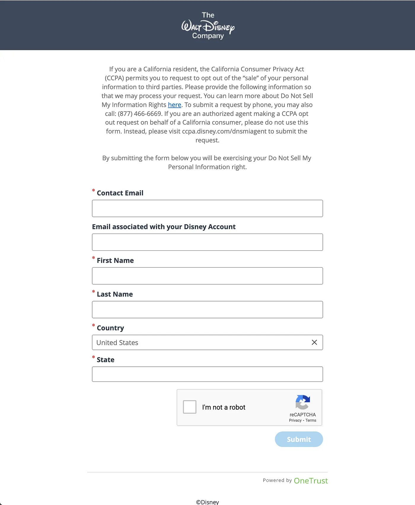

The CCPA says “A consumer shall have the right, at any time, to direct a business that sells personal information about the consumer to third parties not to sell the consumer’s personal information…”.

Sounds good, but to get them to stop selling your data you have to fill in 6 fields, prove you’re not a robot, and click submit. And then repeat for the 200 digital services you use. Not going to happen. Just like you don’t read the 200 privacy notices.

> *Every day, Internet users interact with technologies designed to undermine their privacy. Social media apps, surveillance technologies, and the Internet of Things are all built in ways that make it hard to guard personal information. And the law says this is okay because* **it is up to users to protect themselves** *—* **even when the odds are deliberately stacked against them**. — Privacy’s Blueprint: The battle to control the design of new technologies by Woodrow Hartzog.

Yes, the odds are *deliberately* stacked up against you. These pages effectively shift the burden of protecting yourself to you. Adding insult to injury, they prevent you from automating the task (see, “I’m not a robot” above).

Now it’s true that they give you the option to hire an “authorized [human] agent” to do this for you. But this person has to upload a couple of *additional* documents and fill in a couple *more* fields…200 times.

**Enter Global Privacy Control**

An elegant solution has been developed. Global Privacy Control (GPC) is a proposed specification designed to allow Internet users to notify businesses of their privacy preferences, such as whether or not they want their personal information to be sold or shared. It consists of a setting or extension in the user’s browser or mobile device and acts as a mechanism that websites can use to indicate they support the specification. See https://globalprivacycontrol.org/ for details. 

