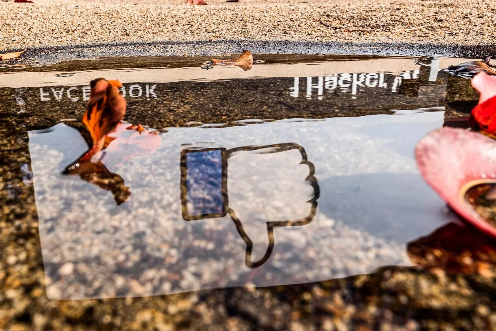
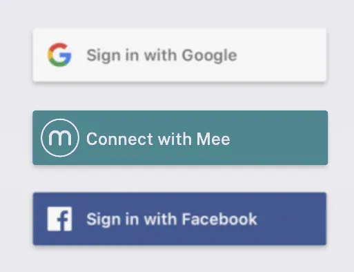

# The Facebook button is disappearing from websites as privacy demands grow

The disappearing login is the latest sign of Facebook’s diminishing influence on the internet after more than a decade of spectacular growth.” [writes Jonathan Vanian from CNBC](https://www.nbcnews.com/tech/social-media/facebook-button-disappearing-websites-privacy-demands-grow-rcna46869).

The Mee Project nonprofit is working on a surveillance-free alternative that involves the installation of a the Mee smartwallet (formerly *identity agent*) on the user’s device. We’ll be [demoing it at IIW 35](https://www.eventbrite.com/e/internet-identity-workshop-iiwxxxv-35-2022b-tickets-368643531727).

Instead of “Sign in with Facebook” (or Google), the user clicks “Connect with Mee”:

The Mee agent is designed to be free, decentralized, open-source, and support the new, self-sovereign [OpenID SIOP](https://openid.net/specs/openid-connect-self-issued-v2-1_0.html) protocol.

“Jen Felch, Dell’s chief digital and chief information officer, said people stopped using social logins, for reasons that include concerns over security, privacy and data-sharing.”

## **Irony in the extreme**

It was the original version of OpenID that was leveraged by Facebook to plaster Sign in with Facebook all over the internet. But now now that users are (finally) starting to care more about privacy, it is a new variant of OpenID (SIOP) and implementations like Mee that can reverse the damage.