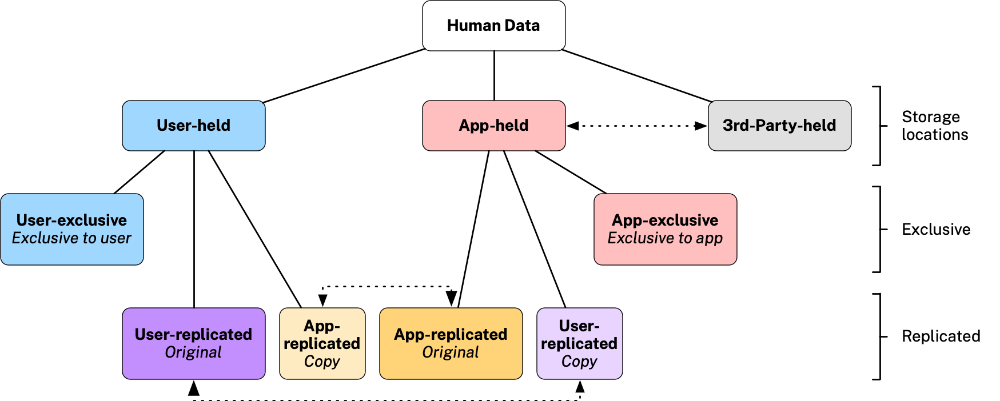

> “Every man has a property in his own person: this nobody has any right to but himself.” — John Locke.¹

A few hundred years later, this truth that Locke argued was “self-evident” does not hold in the digital realm. This is partly because data can’t really be “owned” like other kinds of property. But the main reason we don’t have a sense of “owning” our online selves is that it seems like “[everybody has our data … except us](https://reb00ted.org/personaldata/20210620-who-has-my-personal-data/)!”

Much of our human information (e.g., preferences, interests, affiliations, friends, medical records, location data) is collected by corporations through online surveillance² or simply expropriation. It is held, bought, sold, and leveraged for the corporation’s economic advantage, not ours. We are disempowered; “essential but worthless.”³ ⁴

The resulting loss of privacy and lack of a sense of ownership of our personal data is well-known. There are many projects working to “fix the internet”⁵ that are focused on personal data management. In some of these efforts, decentralized, user-centered architectures based on *user-held⁶* personal data are getting renewed attention. A variation of user-held data that we call *user-exclusive* data is the subject of this article.

## Where is human data stored?

Human/user/personal⁷ data is collected and stored by organizations as users interact with their “apps” (e.g., mobile apps, websites, etc.). We call this *app-held* data. It’s also held by third parties (e.g. data brokers) with whom users have no interactions at all. The resulting data economy with its dominance of app-held and 3rd-party-held data is shown at the left below.

Although still rare in practice, theoretically there is another place where human data can live. It can be held by the user in a *personal data store* (PDS).⁸ ⁹ We call this *user-held* data. A PDS stores the user’s data in the cloud or on an edge device (phone, tablet, laptopc, etc.) or a combination of the two.

## **Data sharing**

The right-hand dotted line in the diagram above shows data sharing between an organization (the app) and a 3rd-party. An example of this would be data brokers buying datasets from apps and selling them to other apps/organizations or government agencies. Another example is when an organization shares personal data with its affiliates, payment processors, etc.

Data sharing also happens between user-held data (in a PDS) and app-held data (in an app) shown in the left-hand dotted line. Data sharing of this kind can happen in both directions. In the first, the user (via their PDS) shares data with an app; we call this data *user-shared.* After sharing, the app typically retains a copy. As an example, the PDS user could decide to share a copy of their fitness data with a fitness-analytics app. Going the other direction, when the app shares data with the user’s PDS we call this *app-shared* data. After sharing, the user’s PDS would typically retain a copy. As an example of this direction, a medical lab might share test results with the user. We have added these two types of shared data on the bottom row below:

## **Replication**

Data sharing can also happen in both directions between the user (the user’s PDS) and an app in what would be called data replication. We show this more nuanced, bi-directional kind of sharing in Figure 4 below.

## Exclusivity

In this article, we call data *exclusive* if there are no permanent copies of it held by any other party. Note that this doesn’t mean that another party (app or user) doesn’t have access; it means that having accessed the data, it doesn’t make copies, except for transient, in-memory caches. From the point of view of these other parties, exclusive data is ephemeral.

There are two kinds of exclusive data. When app-held data is exclusive we call it *app-exclusive.* Except for data requests under GDPR/CCPA/etc., apps rarely share machine-processable user data with the user, although admittedly this is partly because users lack the necessary software tools (e.g., a PDS) on their side to take advantage of it. Thus, almost all app-held data is app-exclusive.

The second kind of exclusive data, called *user-exclusive,* is user-held data that is exclusive. Before we dive more deeply into the details of user-exclusive data, here’s a visual summary of all of the terms we’ve introduced so far:

## User-exclusive personal data

With user-held data, there are typically other copies. By eliminating these copies*¹⁰ ¹¹* user-exclusive data affords a stronger sense of ownership, since you hold the only copy.

We must rely on governance to enforce the “no copy” restriction on this disclosure since no technical means are possible. In the interim, before new information privacy laws arrive, a legal agreement*¹²* could be used between the user (or a fiduciary on the user’s behalf) and the app provider to prohibit the latter from creating permanent copies in their file systems, databases, etc.,¹³ ¹⁴

With user-exclusive data, a sense of ownership¹⁵ ¹⁶ emerges.¹⁷ ¹⁸ ¹⁹ Privacy increases too because there’s nothing for attackers to steal and nothing that can be shared with 3rd parties who may be working against the user’s interests. After an interactive session ends, the user’s personal data disappears from the recipient like footprints in the sand.

Photo by [Khadeeja Yasser](https://unsplash.com/@k_yasser?utm_source=medium&utm_medium=referral) on [Unsplash](https://unsplash.com/?utm_source=medium&utm_medium=referral)

As we’ve mentioned, today most human data is app-held (by organizations), with little or none of it being user-held, let alone user-exclusive. We hope the balance begins to shift towards user-held and user-exclusive data, although the exact mixture will vary since it involves balancing a set of competing considerations: e.g., the user’s need for privacy and agency, on one hand, and the business’ legitimate need to run their organization and comply with the law, on the other. A full discussion of these legal, operational, and economic considerations is beyond the scope of this article, but to give a sense of them here are two brief examples.

**Legal:** In the U.S., state laws require health providers to maintain medical records. The laws differ by state but they generally recognize the provider, not the patient, as the owner of medical records, even if this isn’t always explicitly stated.²⁰ The U.S. federal HIPPA regulation does allow the patient to request a copy of their “protected health information” but doesn’t include the right to delete it from their health provider.²¹

**Economic:** It would be damaging to a firm’s ability to compete if its manager’s private evaluations of employees were fully disclosed to the employees as they would be if this data was user-exclusive.

*A summary of user-exclusive data:*

**1.** At rest, user-exclusive personal data is stored on the user’s devices and/or PDS, and exists nowhere else.

**2.** An organization’s app (e.g. website or mobile app, etc.) requests, via the PDS’ API, access to user-exclusive data from either (i) an app-specific *context* (i.e., an app-specific data container in the PDS) or (ii) the contexts of other apps. Through legal agreement, the organization is prohibited from storing copies of user-exclusive data in their own permanent storage (e.g., filesystems, databases, secure storage areas, etc.). The organization is prohibited from sharing user-exclusive data with any party (other than the user!).

**3.** The app stores user-exclusive data in its app-specific context in the user’s PDS.

**4.** User-exclusive data must either be inherently human-readable or be expressed in both machine-readable and human-readable versions. Wherever possible it must be machine-readable by the user’s PDS using standard schemas.

**5.** User-exclusive data may be deleted by the user at any time.

## Conclusion

We have proposed *user-exclusive* data as a new kind of user-held data that provides the user with increased control and a sense of ownership. We discussed how its ephemeral nature can be implemented through a combination of PDS technology and governance. The result is an internet where people have more ownership of their digital lives. Where users interact with apps that offer unprecedented new services and experiences while respecting the user’s data sovereignty.

# References

Doctorow, C. (2021). Competitive compatibility: let’s fix the internet, not the tech giants. *Communications of the ACM*, *64*(10), 26–29. https://dl.acm.org/doi/fullHtml/10.1145/3446789

Hartzog, W. (2011). Chain-link confidentiality. *Ga. L. Rev.*, *46*, 657. [https://heinonline.org/hol-cgi-bin/get_pdf.cgi?handle=hein.journals/geolr46&section=26](https://heinonline.org/hol-cgi-bin/get_pdf.cgi?handle=hein.journals%2Fgeolr46&section=26)

I.AM, W. (2019, January 21). We need to own our data as a human right — and be compensated for it. *The Economist*. [economist.com/open-future/2019/01/21/we-need-to-own-our-data-as-a-human-right-and-be-compensated-for-it](https://www.economist.com/open-future/2019/01/21/we-need-to-own-our-data-as-a-human-right-and-be-compensated-for-it)

Jurcys, P., Donewald, C., Fenwick, M., Lampinen, M., Nekrošius, V., & Smaliukas, A. (2021). Ownership of User-Held Data: Why Property Law is the Right Approach. *JOLT*. [jolt.law.harvard.edu/digest/ownership-of-user-held-data-why-property-law-is-the-right-approach](https://jolt.law.harvard.edu/digest/ownership-of-user-held-data-why-property-law-is-the-right-approach)

Lanier, J. (2014). *Who owns the future?* Simon and Schuster.

Liddell, K., Simon, D. A., & Lucassen, A. (2021). Patient data ownership: who owns your health? *Journal of Law and the Biosciences*, *8*(2), lsab023. https://doi.org/10.1093/jlb/lsab023

Locke, J. (2014). *Second treatise of government: An essay concerning the true original, extent and end of civil government*. John Wiley & Sons.

Preukschat, A., & Reed, D. (2021). *Self-sovereign identity: decentralized digital identity and verifiable credentials*. Simon and Schuster.

Prewitt, M. (2021, February 23). *A View Of The Future Of Our Data: Welcome to the era of data coalitions.* Noema Magazine. [noemamag.com/a-view-of-the-future-of-our-data/](https://www.noemamag.com/a-view-of-the-future-of-our-data/)

Whitt, R. S. (2021). Hacking the SEAMs: Elevating Digital Autonomy and Agency for Humans. *Colo. Tech. LJ*, *19*, 137. https://ctlj.colorado.edu/?p=720

Zuboff, S. (2019). *The Age of Surveillance Capitalism*. Profile Books.

# Notes

[1] John Locke published his Second Treatise on Government in 1690. (Locke, 2014). “John Locke was an English philosopher who thought a lot about power: who had it, how it was used, and how it impacted the structure of society. Locke’s theory of mind forms the foundation for our modern ideas about identity and independence. Locke argued that “sovereign and independent” was man’s natural state and that we gave up freedom, our sovereignty, in exchange for something else, protection, sociality, and commerce, among others. This grand bargain forms the basis for any society.” — from Phil Windley’s [Technometria](https://www.windley.com/archives/2020/09/the_architecture_of_identity_systems.shtml).

[2] See (Zuboff, 2019).

[3] This particular quote that we are “essential but worthless” is from page 11 of Lanier (2014). The idea that our personal data should be valuable to us (and not just tech giants) is now mainstream. Jennifer Zhu Scott’s 2019 TED talk “[Why you should get paid for your data](https://www.ted.com/talks/jennifer_zhu_scott_why_you_should_get_paid_for_your_data#t-4009)”, for example, has been viewed over 3 million times.

[4] See (Whitt, 2021) [Hacking the SEAMs: Elevating Digital Autonomy and Agency for Humans](https://ctlj.colorado.edu/?p=720).

[5] See (Doctorow, 2021) [Competitive compatibility: let’s fix the internet, not the tech giants](https://dl.acm.org/doi/fullHtml/10.1145/3446789).

[6] See (Jurcys et al., 2021) for a definition of user-held data.

[7] See [gdpr-info.eu/art-4-gdpr](https://gdpr-info.eu/art-4-gdpr/) defining it as “… any information which [is] related to an identified or identifiable natural person…”. See [gdpr.eu/eu-gdpr-personal-data](https://gdpr.eu/eu-gdpr-personal-data) for an elaboration.

[8] Examples of open-source PDSes include [SolidProject.org](https://solidproject.org/), [Identity Hub](https://github.com/decentralized-identity/identity-hub/blob/main/spec/spec.md) (described in [Identity Hubs as personal datastores](https://techcommunity.microsoft.com/t5/azure-active-directory-identity/identity-hubs-as-personal-datastores/ba-p/389577#:~:text=Identity Hubs are decentralized%2C off,data without their explicit permission)), and [Personium](https://personium.io/en/index.html). For more about PDSes see [wikipedia.org/wiki/Personal_data_service](https://en.wikipedia.org/wiki/Personal_data_service).

[9] PDS hosting providers include not-for-profits such as [Mydex.org](https://mydex.org/), and [OwnYourData.eu](https://www.ownyourdata.eu/en/), as well as commercial offerings such as [Prifina.com](https://www.prifina.com/), D[igi.Me](https://digi.me/), [CitizenMe.com](https://citizenme.com/), and [Inrupt.com](https://inrupt.com/).

[10] The copy problem is out of scope for identity management technologies, including [self-sovereign identity](https://en.wikipedia.org/wiki/Self-sovereign_identity) (SSI). In SSI, for example, users own digitally signed copies of source data “verifiable credentials” (VCs), store them in “wallets” and share them with recipient apps (websites, service providers, mobile apps, etc.) (“verifiers”). The source copy remains with the issuer, with the user holding a derivative, digitally signed copy of it. Similarly, the verifier makes a copy of the data payload of the VC after verifying its authenticity. For more see (Preukschat & Reed, 2021).

[11] Copies undermine the sense of ownership. Ownership is sometimes defined as the ability to *possess*, *sell*, *share* and *delete* something. You can’t really be said to *possess* something if others have it too; at best you merely possess your own a copy. You can’t really *sell* your personal data because you’re just providing another copy in return for compensation. Your copy remains, as do all the other copies. This isn’t the typcial meaning of *selling* something. In most cases (e.g., consider the digital art world), each copy devalues the others. It’s hard to effectively *share* your personal data. At best you can distribute static copies that have lost their connection to the original and thus become out-of-date and of unknown provenance. You can’t easily *delete* your personal data. It's easy to delete your own copy (if you have one!), but without some form of automation, it's too time-consuming to manually delete all of the remaining copies held by hundreds of websites.

[12] See (Hartzog, 2011) for a discussion of chain-link confidentiality.

[13] The [Data Collaboration Alliance](https://www.datacollaboration.org/) also promotes the concept of “zero-copy” or #AccessNotCopies and applies it not just to personal data, but to organizational data as well.

[14] Even though individual data ownership rights are not recognized in any jurisdiction, by eliminating the copy problem and giving exclusive possession to the user, user-exclusive data seems to provide an intuitive notion of ownership. (Jurcys et al., (2021)).

[15] Recent calls for ownership include, *We need to own our data as a human right — and be compensated for it* (I.AM, 2019), and [Everybody has our data … except us](https://reb00ted.org/personaldata/20210620-who-has-my-personal-data/).

[16] [MyData.org](https://mydata.org/) seeks “to empower individuals with their personal data…”

[17] See Personal Data Ownership (Jurcyc et al., 2021) for support for leveraging the concept of ownership.

[18] It is argued that *ownership* is the wrong framing for personal data. E.g., Prewitt (2021) argues that due to data’s inherent copy-ability “data cannot be owned, but must be governed.” This is of course true. User-exclusive data relies on governance in the form of confidentiality agreements to be implemented. Nevertheless, the sense of a “lack of ownership” resonates broadly with people.

[19] For other arguments against using the concept of ownership and propertization of personal data (and data in general) see [RadicalxChange.org](https://radicalxchange.org/)’s [Data Freedom Act](https://www.radicalxchange.org/media/papers/data-freedom-act.pdf), which is “…informed by a model of social, overlapping claims to data. This view of data, which challenges more familiar notions of individual data ownership, is echoed by top researchers in the fields of data privacy, security, and network economics.” See also the Technium [Data Manifesto](https://kk.org/thetechnium/data-manifesto/) whose first tenet reads, “Data cannot be owned. By anybody.” Concerning health data, see “Patient data ownership: who owns your health?” (Liddell et al., 2021).

[20] See [It’s time for individuals — not doctors or companies — to own their health data.](https://www.statnews.com/2021/11/15/its-time-for-individuals-not-doctors-or-companies-to-own-their-health-data/)

[21] See page 102 of (U.S. Dept. of Health and Human Services, 2013) and [Individual’s Right under HIPAA to Access their Health Information 45CFR part 164.524](https://www.hhs.gov/hipaa/for-professionals/privacy/guidance/access/index.html) since the assumption is that the provider owns the patient’s health records.